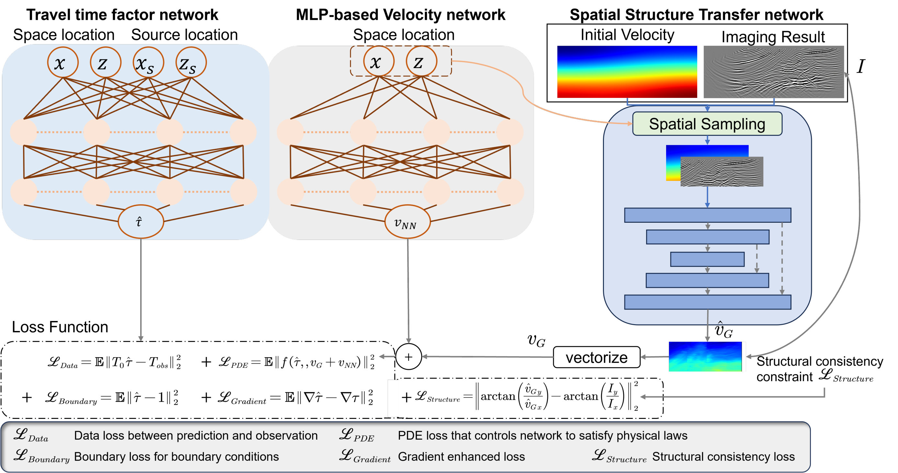

# Space Correlation Constrained Physics Informed Neural Network (SC-PINN) for Seismic Tomography

This repository contains the source code for the paper **"Space Correlation Constrained Physics Informed Neural Network for Seismic Tomography"**, accepted by *JGR: Machine Learning and Computation* on January 30, 2026.

## Overview

Seismic tomography is a critical method for imaging the Earth's subsurface structure. We develop an improved framework, **Space Correlation Constrained Physics-Informed Neural Network (SC-PINN)**, to enhance tomography accuracy. Unlike traditional methods or standard PINNs, SC-PINN explicitly integrates:
1.  **Physical Principles**: The Eikonal equation governing seismic wave propagation.
2.  **Observational Data**: Seismic traveltime data.
3.  **Geological Structure Priors**: Spatial correlation constraints derived from seismic imaging integration.

This approach demonstrates superior performance in resolving complex velocity variations and is validated on both synthetic datasets (e.g., Marmousi model) and field data (Viking Graben).



## Project Structure

The repository is organized as follows:

```
SC-PINN/
├── ApplyScripts/       # Main training scripts
│   ├── TrainPINN.py    # Training script for standard PINN
│   └── TrainSCPINN.py  # Training script for SC-PINN (Proposed Method)
├── configjson/         # Configuration files for experiments
│   ├── PINN.json       # Config for PINN experiments
│   └── SCPINN.json     # Config for SC-PINN experiments
├── DATA_FOLDER/        # Directory for input data (velocity models, traveltimes, etc.)
├── model/              # Neural Network architecture definitions
├── result/             # Output directory for logs, checkpoints, and figures
├── util/               # Utility functions (plotting, file I/O)
├── runPINN.sh          # Shell script to execute PINN training
└── runSCPINN.sh        # Shell script to execute SC-PINN training
```

## Requirements

The project is implemented in Python. We recommend using a virtual environment (e.g., Conda) with the following dependencies:

*   **Python** >= 3.8
*   **PyTorch** >= 1.10 (with CUDA support)
*   **NumPy**
*   **Matplotlib** (for visualization)
*   **TensorBoard** (for logging training progress)
*   **Loguru** (for logging)
*   **Pytorch-Warmup** (for learning rate scheduling)
*   **Kornia** (for image filtering operations in structural loss)

## Usage

### 1. Data Preparation
Ensure your dataset files (initial velocity, true velocity, traveltime tables, seismic profiles) are placed in the `DATA_FOLDER/` or specified paths in the run scripts. 
*   `.rsf` (Madagascar) and `.npy` formats are supported.

### 2. Configuration
Hyperparameters for the experiments are defined in the JSON files located in `configjson/`. You can modify parameters such as:
*   `epochs`: Total number of training epochs.
*   `lr`: Learning rate.
*   `GPUIDs`: GPU device IDs to use.
*   `velLossceoff`, `pde_coeff`, `data_coeff`: Weighting coefficients for loss terms.

### 3. Running Experiments

To reproduce the **SC-PINN** results (e.g., with a linear initial model):
```bash
bash runSCPINN.sh
```

To run the baseline **PINN** method:
```bash
bash runPINN.sh
```

These scripts will automatically:
1.  Load the configuration.
2.  Back up the source code and config for the specific experiment run.
3.  Start the training process.
4.  Save logs to `result/<ExpName>/<BaseFileName>_exp<Iter>/PINNTomo.log`.
5.  Save TensorBoard events to `result/<ExpName>/<BaseFileName>_exp<Iter>/tb_runs/`.
6.  Save model checkpoints and visualization figures in the result directory.

## Key Features

*   **DVG-PDE Loss**: A gradient-enhanced loss function for solving the Eikonal equation.
*   **Structural Constraint**: Utilizes dip loss and total variation (TV) regularization to enforce geological consistency with seismic stacked profiles.
*   **Automatic Mixed Precision (AMP)**: Supported for efficient training on GPUs.

## Citation

If you use this code or find it useful in your research, please cite our paper:

```bibtex
@article{wang2026scpinn,
  title={Space Correlation Constrained Physics Informed Neural Network for Seismic Tomography},
  author={Wang, Yonghao and Jia, Zhuo and Jiang, Bowu and Lu, Wenkai},
  journal={JGR: Machine Learning and Computation},
  year={2026},
  note={Accepted}
}
```

## License

This project is open-source. Please refer to the license file for details.
